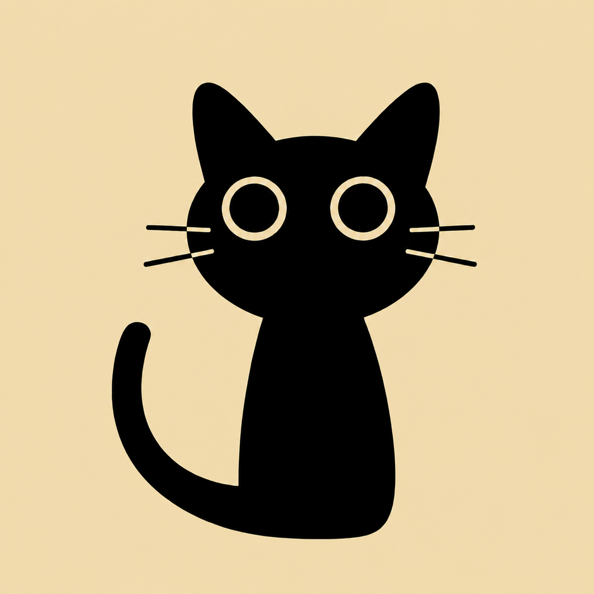

# TaskPet

<p align="center">
  
</p>

<p align="center">
  <strong>让一只常驻桌面的动画宠物，陪你把任务真正做完。</strong>
</p>

<p align="center">
  本地优先 · Windows 桌面端 · 无账号 · 无云同步 · 不记录无关进程历史
</p>

<p align="center">
 <strong>AI Vibe Coding </strong>
</p>


## 项目简介

TaskPet 是一个本地运行的桌面任务助手。你可以创建任务，并把自己选择的 Windows 程序绑定到任务上；当目标程序运行时，TaskPet 自动开始累计实际使用时间，程序退出后暂停累计，达到目标时长后自动完成任务。

<strong>使用说明</strong> ：左键打开/关闭任务面板   右键打开/关闭设置

<strong>本人体验</strong>：我感觉还不错，打游戏时可以计时，只要你不动桌宠就会置顶在游戏页面上，还能一键启动游戏，差不多相当于一个任务管理和时间统计工具，多任务时，隔3s会切换显示，桌宠大小设置看情况再修改了，目前感觉良好

## 核心功能

- 每日任务和一次性任务
- 手动完成、目标时长完成、启动即完成
- 按 exe 精确路径或进程名绑定程序
- 自动开始、暂停、续接任务累计时间
- 今日任务、最近 30 天历史、今日/本周总计时
- 透明无边框桌宠、拖拽、置顶、召回与三档大小
- 鼠标左键、双击、右键动作绑定
- Tray 快速添加、显示/隐藏、暂停/恢复监控和开机启动
- 独立设置窗口、数据目录、SQLite 备份和第三方许可证入口
- PetDex 兼容桌宠 ZIP 拖拽导入、文件选择和文件夹导入

## 展示
<p>  <strong>任务面板 </strong></p>

<p>  <strong>累计时长页面 </strong></p>

<p>  <strong>设置 </strong></p>

<p>  <strong>桌宠替换页面 </strong></p>

<p>  <strong>任务执行中画面 </strong></p>


## 工作原理

TaskPet 不会持续记录“用户打开过哪些软件”。它只对用户主动绑定的程序做低频即时匹配：

```text
创建任务并绑定目标 exe
        ↓
目标程序出现：任务 pending → active
        ↓
按真实经过时间累计，不按 PID 数量重复计算
        ↓
目标程序退出：经过约 4 秒确认后暂停
        ↓
下次启动同一程序：从已有累计时间继续
        ↓
累计达到目标：任务只完成一次，桌宠播放完成状态
```

任务、任务实例和程序会话分别保存。每日任务会为新的一天生成新的 `TaskOccurrence`，不会通过清空昨天的完成状态来“重置”。

## 软件界面

| 界面 | 用途 |
| --- | --- |
| 桌宠 | 常驻桌面、显示任务状态、拖拽与鼠标快捷动作 |
| 任务面板 | 今日任务、历史记录、总计时、添加/编辑任务和程序绑定 |
| 设置 | 开机启动、桌宠选择与大小、鼠标绑定、数据、关于 |
| 系统托盘 | 快速添加、显示/隐藏、召回、暂停监控、设置与退出 |

设置窗口和任务面板是彼此独立的窗口；关闭设置不会关闭桌宠或任务监控。

## 技术栈

- Electron 28
- TypeScript 5
- SQLite / `better-sqlite3`
- Win32 进程读取 / `koffi`
- Zod IPC 参数校验
- electron-builder / NSIS
- Node.js 原生 test runner

## 项目架构

```text
Electron Main Process
├── 桌宠窗口、Tray、设置和应用生命周期
├── TaskSystem（任务子系统协调器）
│   ├── TaskService / Repository / SQLite
│   ├── ProcessProvider → ProcessMatcher → ProcessMonitor
│   ├── RuntimeTracker → TaskEventBus → PetStateMachine
│   └── DataService / LoginItemService
└── 安全 Preload
    ├── 桌宠 Preload → 桌宠 Renderer
    ├── 面板 Preload → 任务面板 Renderer
    └── 设置 Preload → 设置 Renderer
```

所有文件系统、SQLite、系统进程和窗口能力都留在 Main Process。Renderer 保持 `contextIsolation: true`、`nodeIntegration: false`，任务面板和设置窗口还启用了 sandbox；页面只能调用 Preload 暴露的固定 IPC。

## 任务类型

| 类型 | 行为 |
| --- | --- |
| 每日任务 | 每个本地自然日生成一个新的任务实例，历史互不覆盖 |
| 一次性任务 | 保留同一个任务实例，直到完成或归档 |

| 完成方式 | 行为 |
| --- | --- |
| 目标时长 | 绑定程序累计达到目标时长后自动完成，默认方式 |
| 手动勾选 | 由用户在今日任务中完成或重新打开 |
| 启动即完成 | 检测到绑定程序启动后立即完成，不创建持续计时会话 |

## 程序监控

- 只匹配任务主动绑定的程序，不保存完整系统进程快照。
- 支持精确 exe 路径和进程名匹配；精确路径更不容易误匹配。
- 多个同名 PID 只计算一份 wall-clock 时间。
- 默认约 2.5 秒扫描一次，程序消失后约 4 秒再次确认。
- 没有待监控任务或用户暂停监控时，`ProcessMonitor` 不保留无意义的扫描 timer。
- 今日任务中的“启动”按钮只会打开用户明确选择过的 exe，不接受任意 shell 命令。

## 总计时

“总计时”统计的是 TaskPet 已实际记录的程序运行时间，不是任务目标时长。

- 今日计时：本地当天 `00:00` 至 `23:59`。
- 周计时：本地自然周周一 `00:00` 至周日 `23:59`。
- 任务按累计时长从高到低排序。
- 正在运行的会话会与已保存的 `ProcessSession` 一起统计。

## 桌宠系统

发布包会携带 `src/assets/pets` 当前目录中的宠物资源，不会在构建时恢复已删除资源，也不会在界面中区分资源来源。TaskPet 使用六个基础状态：

```text
idle / working / done / attention / drag-left / drag-right
```

桌宠大小预设：

| 大小 | 宠物视觉尺寸 | 窗口尺寸 |
| --- | ---: | ---: |
| 小 | 48 × 52 | 60 × 72 |
| 正常（默认） | 96 × 104 | 120 × 143 |
| 大 | 105 × 115 | 132 × 157 |

## 自定义桌宠

设置 → 桌宠 → 导入宠物支持：

- 把一个 `pet.zip` 拖入导入区域
- 通过文件选择器选择 ZIP
- 选择一个已经解压的宠物文件夹

可在 [PetDex](https://petdex.dev/zh) 下载社区宠物，或使用 [Hatch Pet](https://petdex.dev/zh/create) 创建兼容图集。一个最小宠物包如下：

```text
pet.zip
├── pet.json
└── spritesheet.webp   # 也支持 PNG
```

```json
{
  "id": "example-pet",
  "displayName": "示例桌宠",
  "description": "一只示例桌宠",
  "spritesheetPath": "spritesheet.webp",
  "frame": {
    "width": 192,
    "height": 208,
    "columns": 8,
    "rows": 9
  }
}
```

ZIP 最大 50 MB。导入器会校验文件路径、清单、图集尺寸和透明背景，并只保存 `pet.json` 与它引用的 PNG/WebP 图集。

`pet.json` 的 `id` 最多 48 个字符，支持大小写英文字母、数字、连字符、下划线和汉字，例如 `TaskPet-桌宠_01`。汉字校验使用 JavaScript 原生 Unicode 正则，不需要额外字库，不会增加安装包体积。

### 用户桌宠保存位置

默认桌宠与用户导入的桌宠使用同一个目录，不再按来源分开，也不会在界面中显示来源字样。

开发仓库中的目录是：

```text
src\assets\pets\<pet-id>\
├── pet.json
└── spritesheet.webp
```

也就是仓库相对路径 `src\assets\pets`。ZIP、文件选择和文件夹导入都会写入这里。

发布版不能写入只读的 `app.asar`，因此构建会把同一目录复制到安装资源目录：

```text
<TaskPet 安装目录>\resources\src\assets\pets\<pet-id>\
```

发布版导入也写入这个目录。安装 TaskPet 时应选择当前 Windows 用户有写入权限的位置；导入失败时应用会显示错误，不会悄悄改存到用户目录或系统盘。

## 数据与隐私

Windows 默认数据目录为：

```text
%APPDATA%\TaskPet\
├── taskpet.sqlite3
├── settings.json
├── logs\
└── backups\
```

具体路径始终以设置 → 数据中显示的“打开数据目录”为准。

- 任务、任务实例、程序绑定规则、相关运行会话和应用设置保存在本机。
- 不记录键盘、鼠标行为、截图、剪贴板、窗口标题、浏览内容或无关进程历史。
- 进程快照只在内存中用于当前匹配，完成后即丢弃。
- “导出备份”使用 SQLite Online Backup，不直接复制可能仍在写入的 WAL 数据库。
- 自动更新未启用，也不存在指向上游 `desktop-pet` Release 的 updater 配置。

## 安装与使用

1. 下载并运行 `TaskPet-1.0.0-win32-x64.exe`。
2. 选择安装目录并完成安装。
3. 从桌宠或 Tray 打开任务面板。
4. 添加任务；需要自动计时时，选择并绑定目标 exe。
5. 启动目标程序，TaskPet 会自动累计任务时间。

当前 Windows 安装包未做商业代码签名，系统可能显示“未知发布者”提示。请只从你信任的 TaskPet 发布页获取安装包。

## 开发环境

- Windows 10/11 x64
- Node.js 18 或更高版本
- npm
- 用于原生模块编译的 Windows C++ 构建环境（只在本机需要重建依赖时使用）

## 本地开发

```bash
npm install
npm test
npm run start
```

常用验证命令：

```bash
npm run compile
npm run smoke
npm run perf:smoke
npm run dev:bounds
```

`npm run smoke` 会用隔离数据目录初始化桌宠、任务面板、设置窗口和 SQLite，成功后自动退出。`dev:bounds` 用于显示桌宠窗口、宠物命中区与图集帧边界。

## 构建 Windows 安装包

```bash
npm test
npm run build:win
```

构建产物位于：

```text
dist\TaskPet-1.0.0-win32-x64.exe
dist\win-unpacked\
```

`publish: null` 且构建命令使用 `--publish never`，构建过程不会自动上传 Release。

## 项目目录

```text
TaskPet/
├── src/
│   ├── main.js                  # Electron 主入口
│   ├── main/                    # 数据、服务、IPC、监控、计时和窗口
│   ├── preload/                 # 面板与设置的安全桥
│   ├── renderer/                # 桌宠、任务面板和设置界面
│   ├── shared/                  # 前后端共享类型与 Zod 契约
│   └── assets/                  # Logo 与统一宠物目录
├── test/                        # 单元与结构回归测试
├── scripts/                     # 测试、性能与桌宠包 smoke
├── electron-builder.yml         # 发布打包配置
└── package.json                 # 脚本、依赖和唯一版本来源
```

## 当前版本

**TaskPet v1.0.0**（v1.0 正式版）

设置页“关于”中的版本、Windows exe 元数据和安装包文件名都来自根目录 `package.json` 的 `version`。发布新版本时修改该字段，并同步 `package-lock.json` 即可。

## License

TaskPet 代码使用 [MIT License](LICENSE)。第三方依赖声明见 [THIRD_PARTY_LICENSES.txt](THIRD_PARTY_LICENSES.txt)。

自定义或默认桌宠素材可能有各自的版权与使用条款；导入和分发前请确认你拥有相应授权。

## 致谢 / 第三方项目

- 桌宠 Shell 的早期实现参考并精简自 MIT 项目 [yangbuyiya/desktop-pet](https://github.com/yangbuyiya/desktop-pet)。
- 自定义宠物包兼容 [PetDex](https://petdex.dev/zh) / Codex 风格的 `pet.json + spritesheet` 格式。
- 感谢 Electron、SQLite、better-sqlite3、koffi、Zod 与 electron-builder 社区。
